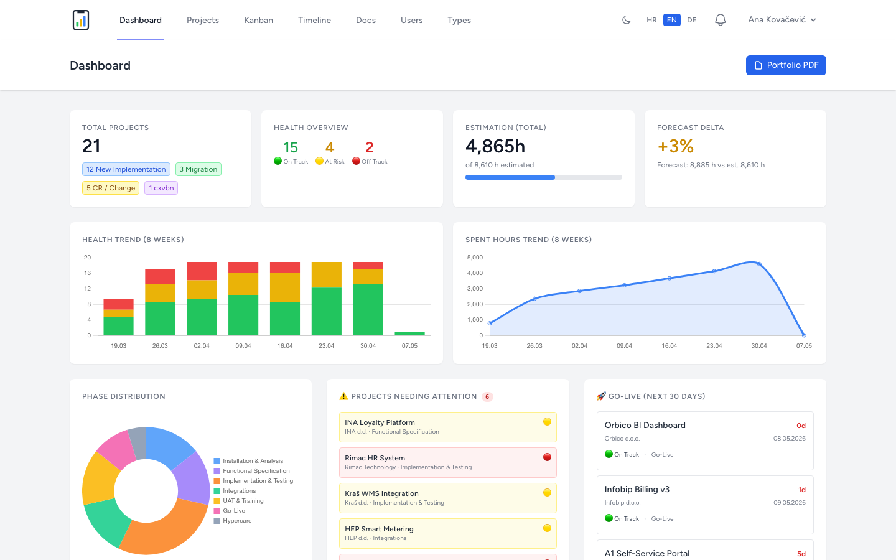
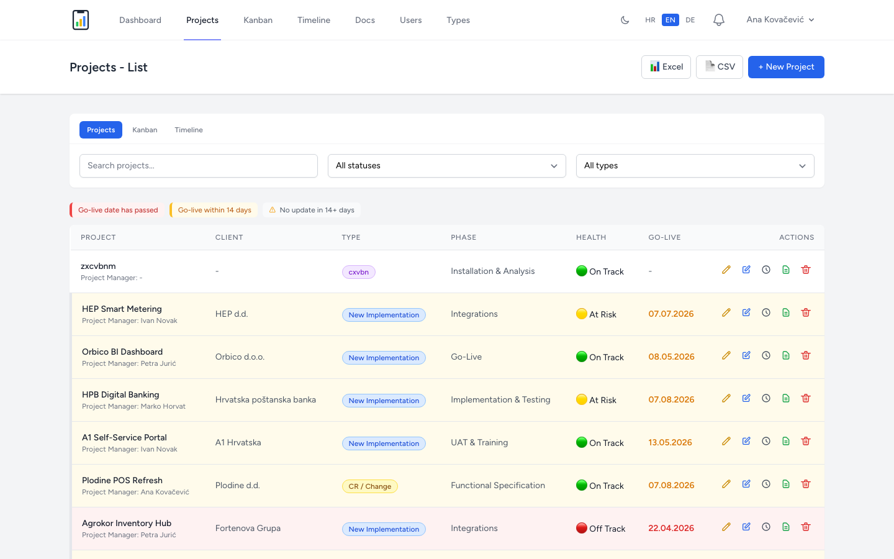
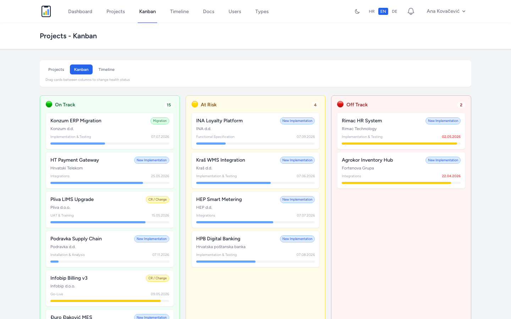
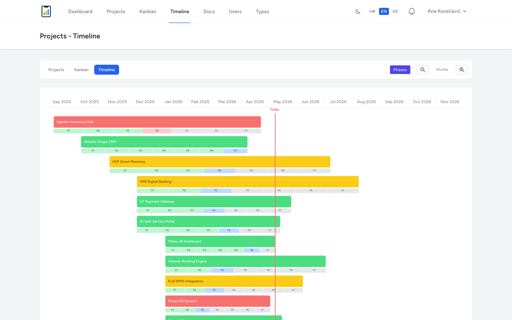
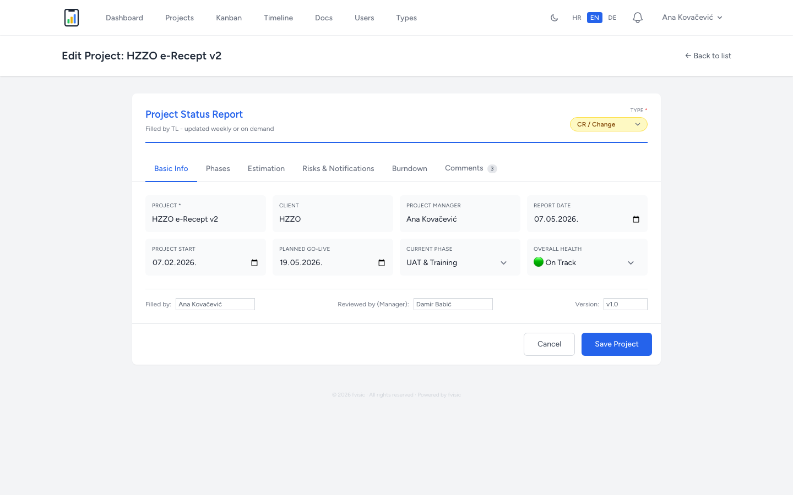
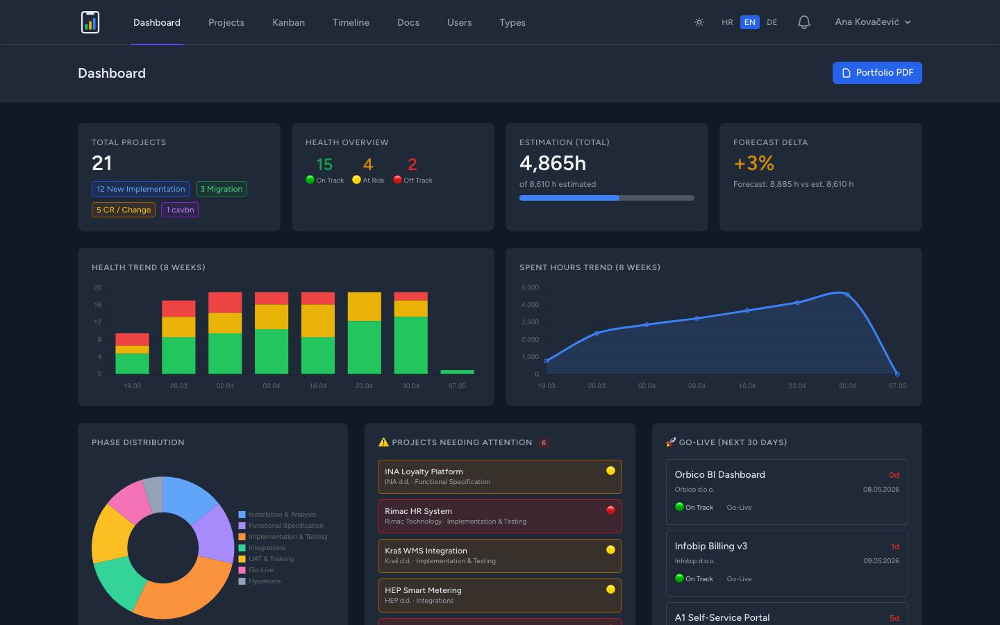

# Project Status

**Portfolio health at a glance — for teams already drowning in Jira tickets.**

You have Jira. You have Teams. You might even have standups. And still — on any given Monday morning — you can't answer: *Is the EU funds project on track? What's the real delivery date for that enterprise client? Which of our 10 active initiatives is the biggest risk right now?*

Jira is excellent at tracking tasks within a project. It's not built to give you a bird's-eye view across 10 parallel initiatives — EU grants, AI pilots, group-wide projects, key accounts, small clients — all at once.

**Project Status fills that gap.** It's a self-hosted dashboard that answers three questions across your entire portfolio:

- **Is this on track?** — health status per project (on track / at risk / off track), updated by the team, visible at a glance
- **When is it actually due?** — Gantt timeline with real deadlines, not sprint estimates
- **Where's the risk?** — structured risk log per project, surfaced at portfolio level

It's not a Jira replacement. It runs alongside it — one tab for your ticket backlog, one tab for whether the whole thing is on track.

---

## Screenshots

| Dashboard | Project List |
|-----------|-------------|
|  |  |

| Kanban | Timeline |
|--------|----------|
|  |  |

| Project Detail | Dark Mode |
|----------------|-----------|
|  |  |

---

## Tech Stack

| Layer     | Technology                           |
|-----------|--------------------------------------|
| Backend   | PHP 8.3+, Laravel 13                 |
| Frontend  | Livewire 3, Tailwind CSS 3, Alpine.js|
| Charts    | Chart.js 4                           |
| Database  | MySQL 8.4                            |
| Auth      | TOTP 2FA, WebAuthn (passkeys)        |
| i18n      | 3 languages (HR, EN, DE)             |
| Tests     | PHPUnit, Playwright                  |
| Deploy    | Docker (nginx + PHP-FPM)             |

## Features

- Project CRUD with health tracking (on track / at risk / off track)
- Dynamic project types — admin-managed CRUD with color picker, soft delete, used everywhere types appear
- Dashboard with KPI cards, health trends, burndown charts
- Kanban board with drag-and-drop health updates
- Gantt timeline view with zoom controls
- Role-based access (admin / manager / user)
- Admin impersonation
- Login with email or username
- TOTP 2FA and WebAuthn passkey authentication
- Excel/PDF export, portfolio PDF reports
- Email notifications and weekly reports
- Project snapshots and history diffing
- Dark mode
- Fully offline-capable deployment

## Codebase Statistics

*Last updated: 2026-04-15*

### Custom PHP Classes (app/)

| Directory           | Files | Description              |
|---------------------|------:|--------------------------|
| Livewire            |    15 | Livewire components      |
| Models              |     7 | Eloquent models          |
| Http (Controllers)  |     7 | Controllers, middleware  |
| Console             |     3 | Artisan commands         |
| Notifications       |     2 | Email/DB notifications   |
| View                |     2 | View components          |
| Providers           |     2 | Service providers        |
| Policies            |     1 | Authorization policies   |
| Exports             |     1 | Excel exports            |
| Channels            |     1 | Broadcast channels       |
| **Total**           | **42**| **2,645 lines**          |

### Full Project Breakdown

| Category                          | Files | Lines  |
|-----------------------------------|------:|-------:|
| Application code (app/)           |    42 |  2,645 |
| Blade templates                   |    49 |  4,909 |
| Database (migrations, seeders, factories) | 22 | 1,261 |
| Tests (PHPUnit)                   |    33 |  5,388 |
| Tests (Playwright E2E)            |    17 |    497 |
| Routes                            |     1 |    105 |
| Config                            |     - |  1,423 |
| Translations (3 languages)        |    31 |  2,885 |
| JavaScript                        |     - |    550 |
| CSS                               |     1 |     31 |
| **Total**                         |       | **19,694** |

### Key Metrics

| Metric                           | Value |
|----------------------------------|------:|
| Custom PHP classes               |    42 |
| Custom PHP lines of code         | 2,645 |
| Blade templates                  |    49 |
| Database migrations              |    19 |
| Eloquent models                  |     7 |
| Livewire components              |    15 |
| PHPUnit test files               |    33 |
| PHPUnit test methods             |   345 |
| Playwright E2E specs             |    17 |
| Playwright E2E test cases        |    41 |
| Translation keys (per language)  |  ~700 |
| Supported languages              |     3 |
| Total project lines of code      | 19,694|

## Offline Deployment

See [INSTALL.md](INSTALL.md) for the complete offline Docker distribution guide, including:
- Quick start (3 steps)
- Docker installation for Linux/Windows/macOS
- LAN access and firewall configuration
- HTTPS setup (Let's Encrypt, self-signed, Caddy)
- Backup and restore

## WebAuthn / Passkeys in Offline Mode

WebAuthn works fully offline - the server never contacts Apple/Google/FIDO during register or login. Verification is pure local cryptography.

**Requirements:**
- HTTPS is mandatory (browsers refuse WebAuthn on plain HTTP, except localhost)
- Stable hostname in `WEBAUTHN_ID` (changing it invalidates all existing passkeys)

**What works offline:**
- Same-device passkey login (Touch ID, Windows Hello, YubiKey)
- TOTP 2FA (pure HMAC-SHA1 crypto, no external calls)
- All other features (PDF generation, exports, role system, impersonation)

**What needs internet (client-side only):**
- Passkey sync across devices (iCloud Keychain / Google Password Manager)
- Cross-device QR flow (Bluetooth + Apple/Google rendezvous servers)

### .env for LAN deployment

```env
APP_URL=https://projectstatus.local
WEBAUTHN_ID=projectstatus.local
WEBAUTHN_ORIGINS=https://projectstatus.local
```

## TOTP 2FA in Offline Mode

Fully offline. TOTP is `HMAC-SHA1(shared_secret, time / 30s)` - pure local crypto. QR code is generated server-side as inline SVG. Only caveat: server clock must be within ~30s of clients (use an internal NTP server on LAN).

## Docker Installation

**Requirements:** [Docker Desktop](https://www.docker.com/products/docker-desktop/)

### Quick Start

**1. Clone and enter the directory**

```bash
git clone https://github.com/fvisic/ProjectStatusApp.git
cd ProjectStatusApp
```

**2. Create your `.env` file**

```bash
cp .env.example .env
```

Open `.env` and set the following values:

```env
APP_NAME="Project Status"
APP_KEY=        # generate: docker run --rm php:8.3-cli php -r "echo 'base64:'.base64_encode(random_bytes(32)).PHP_EOL;"
APP_URL=http://localhost:54322

DB_DATABASE=project_status
DB_USERNAME=project_status
DB_PASSWORD=your_password_here
DB_ROOT_PASSWORD=your_root_password_here
```

**3. Build and start containers**

```bash
docker compose up -d --build
```

First build takes ~3–5 minutes. On first boot, migrations run automatically. If `RUN_SEED=1` is set in `.env` (default in `.env.example`), demo data is seeded automatically as well.

App is now available at **http://localhost:54322**

---

### Demo User Accounts

All demo users use the password: **`Demo1234!`**

| Role    | Name          | Username      | Email           |
|---------|---------------|---------------|-----------------|
| Admin   | Sarah Chen    | sarah.chen    | sarah@example.com   |
| Manager | James Miller  | james.miller  | james@example.com   |
| User    | Priya Sharma  | priya.sharma  | priya@example.com   |
| User    | Tom Weber     | tom.weber     | tom@example.com     |

The **admin** account (`sarah@example.com`) has full access including user management and impersonation.

---

### Creating an Admin Account (without demo data)

If you start without `RUN_SEED=1`, run this to create an admin user interactively:

```bash
docker exec -it projectstatus-app php artisan app:create-admin
```

### Common Commands

| Action            | Command                                                          |
|-------------------|------------------------------------------------------------------|
| Stop              | `docker compose down`                                            |
| Start             | `docker compose up -d`                                           |
| View logs         | `docker compose logs -f app`                                     |
| Run migrations    | `docker exec projectstatus-app php artisan migrate --force`      |
| Open Tinker       | `docker exec -it projectstatus-app php artisan tinker`           |

### Production Deployment

For a production server, use `.env.production.example` as your starting point instead of `.env.example`:

```bash
cp .env.production.example .env
```

Key differences from the dev config:

| Setting | Value | Notes |
|---|---|---|
| `APP_ENV` | `production` | Disables debug output |
| `APP_DEBUG` | `false` | Never expose stack traces |
| `APP_KEY` | *(generate)* | `php artisan key:generate` or docker one-liner |
| `APP_URL` | `https://your-domain.com` | Must match your actual domain |
| `LOG_CHANNEL` | `stderr` | Docker-friendly (collected by `docker logs`) |
| `SESSION_SECURE_COOKIE` | `true` | Requires HTTPS |
| `RUN_SEED` | `0` | No demo data on production |
| `TRUSTED_PROXIES` | `*` | Needed if behind a reverse proxy/load balancer |

Set strong passwords for `DB_PASSWORD` and `DB_ROOT_PASSWORD` before first boot.

### Data Persistence

MySQL data is stored in `./data/mysql` and application uploads in `./data/storage` (both created automatically, excluded from git).

To reset everything (deletes all data):

```bash
docker compose down -v
rm -rf data/
```
